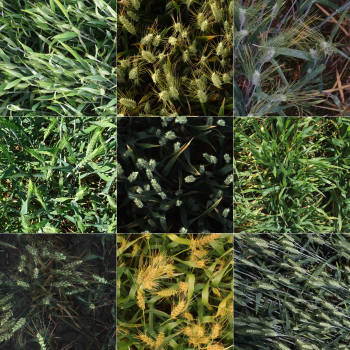

# Wheat detection using faster RCNN in pytorch

The notebook describes how to train a Faster RCNN network to detect wheat heads from outdoor images of wheat plants.  
Data can be downloaded from the [kaggle competition page.](https://www.kaggle.com/c/global-wheat-detection/data) The model was trained on google colab. 

